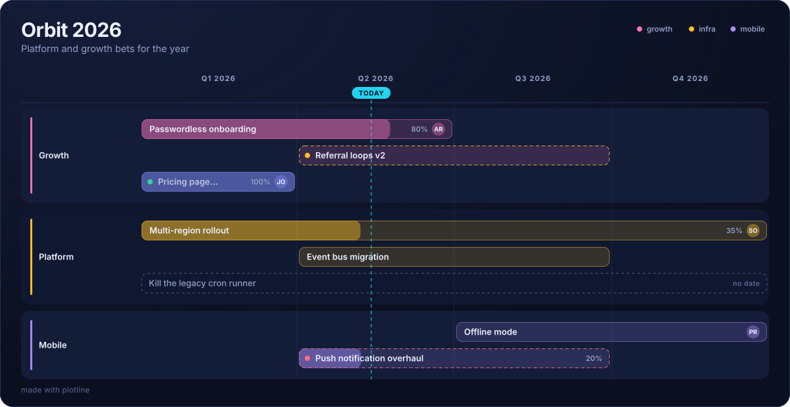
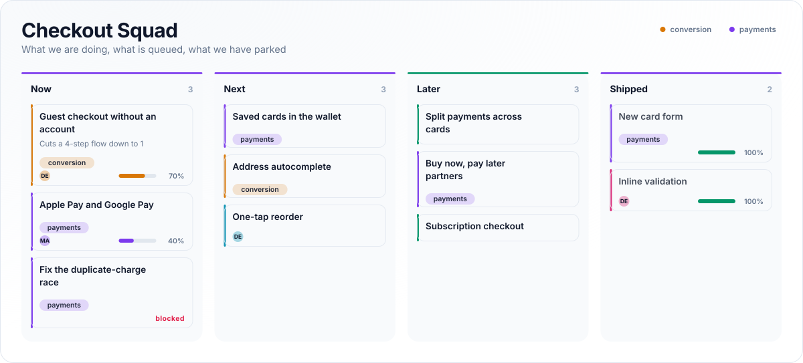
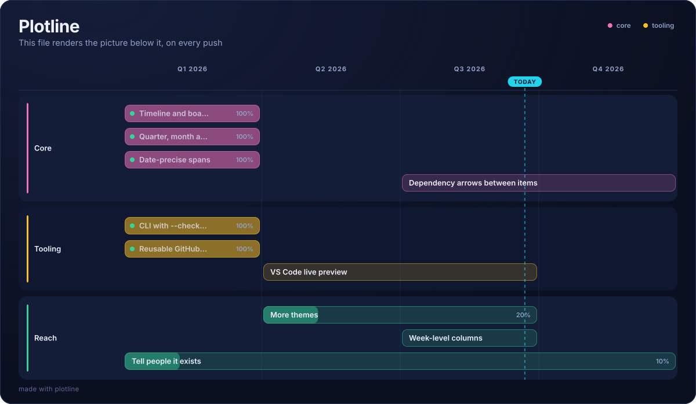

<div align="center">


# Plotline

### Plain-text roadmaps, rendered.

Write your roadmap as a few lines of Markdown. Get something you can put in front of anyone.

**[Open the editor →](https://umeramin99.github.io/plotline/)** &nbsp;·&nbsp; no signup, no server, works offline

[](https://github.com/umeramin99/plotline/actions/workflows/ci.yml)
[](LICENSE)


</div>

---

This:

```markdown
# Orbit 2026
> Platform and growth bets for the year

@timeline Q1 2026 -> Q4 2026
@today 2026-05-14

## Growth
- Passwordless onboarding @q1..q2 ~80% +ana-rivera #growth
- Referral loops v2 @q2..q3 #growth !risk
- Pricing page rebuild @q1 ~100% +joel !done

## Platform
- Multi-region rollout @q1..q4 ~35% +sam-okafor #infra
- Event bus migration @q2..q3 #infra
- Kill the legacy cron runner
```

Becomes this:



No `@timeline`? You get a board instead — same file, same syntax:



## Why

Roadmaps live in three bad places: a slide someone rebuilds every quarter, a
Jira view nobody outside the team can read, or a SaaS tool at $20 per seat per
month. All three drift from what the team is actually doing, because updating
them is a chore.

Plotline puts the roadmap in your repo as a text file:

- **It diffs.** Moving a bet from Q2 to Q3 is a one-line change in a pull request, with a reviewer and a reason.
- **It renders.** One command turns it into something you can drop in a board deck without apologising for it.
- **It stays honest.** The file sits next to the code, so it gets updated when the plan changes rather than the week before the review.
- **It costs nothing.** MIT, no account, no telemetry, no backend to run.

## Use it

**In the browser.** Go to [the editor](https://umeramin99.github.io/plotline/),
type, export PNG or SVG. The page is a single 51 kB HTML file — save it and it
works on a plane. Nothing is uploaded, because there is nowhere to upload to.

**In the terminal.** No install, no dependencies:

```bash
npx plotline roadmap.md -o roadmap.svg
npx plotline roadmap.md --theme slate --width 1600 -o wide.svg
npx plotline roadmap.md --check     # exit 1 if the file has problems
```

**In CI.** Keep a rendered roadmap in your README that updates itself on every
push. Copy [`.github/workflows/roadmap.yml`](.github/workflows/roadmap.yml)
into your repo, add `roadmap.md`, and put this in your README:

```markdown

```

That is the whole loop: edit the text, merge the PR, the picture updates.

## The format

It is Markdown. Open `roadmap.md` on GitHub without any tooling and it still
reads like a roadmap.

| You write | You get |
| --- | --- |
| `# Orbit 2026` | Title |
| `> Bets for the year` | Subtitle |
| `## Growth` | A lane (timeline) or a column (board) |
| `- Ship onboarding` | An item |
| `  - why it matters` | A note under the item |

Modifiers go **at the end of an item line**, in any order:

| Modifier | Means | Example |
| --- | --- | --- |
| `@span` | When | `@q2` · `@q1..q3` · `@2026-04-15..2026-07-01` · `@2` |
| `~pct` | Progress | `~60%` |
| `+owner` | Who | `+ana-rivera` · `+"Ana Rivera"` |
| `#tag` | Theme of work, and its colour | `#growth` |
| `!status` | State | `!done` · `!shipped` · `!risk` · `!blocked` |

Anything before the modifiers is the title, so `Email ana@example.com about #1`
stays exactly as written.

Directives configure the document:

| Directive | Does |
| --- | --- |
| `@timeline Q1 2026 -> Q4 2026` | Switch to a timeline. Also `Jan 2026 .. Jun 2026` or `2026 -> 2028` |
| `@columns Discovery, Build, Launch` | Name your own columns |
| `@today 2026-05-14` | Draw the today marker. `@today now` uses the clock |
| `@theme aurora` | `aurora` · `noir` · `slate` · `dawn` · `sunset` |
| `@width 1600` | Canvas width in pixels |
| `@footer off` | Remove the footer line |

Full details in [SPEC.md](SPEC.md).

## Themes

`aurora` (default) · `noir` · `slate` · `dawn` · `sunset` — two dark, two light,
one for when you want the deck to look expensive.

## As a library

The renderer is a pure function with no DOM and no dependencies, so the browser,
the CLI and CI all produce byte-identical SVG.

```js
import { parse, render } from 'plotline';

const svg = render(parse('# Q3\n## Now\n- Ship it ~80%\n'), { theme: 'slate' });
```

## What it does not do

Being clear about this up front: no dependency arrows between items (yet), no
resource levelling, no critical path, no percent-complete rollups, no import
from Jira. It draws the roadmap you wrote down. If you need a project
management system, you need a project management system.

## The roadmap, obviously

This picture is rendered from [`roadmap.md`](roadmap.md) by
[the workflow](.github/workflows/roadmap.yml) in this repo, on every push. It is
the loop described above, running on itself.


## Contributing

Issues and pull requests welcome — see [CONTRIBUTING.md](CONTRIBUTING.md).
The whole thing is about 1,400 lines of plain JavaScript with no build step to
learn:

```bash
git clone https://github.com/umeramin99/plotline
cd plotline
npm test          # 41 tests, no dependencies to install
npm run build     # regenerate docs/index.html
open docs/index.html
```

## License

MIT. Use it at work, fork it, ship it inside your own product, no attribution
required. The `made with plotline` footer is one line of text and `@footer off`
removes it.
